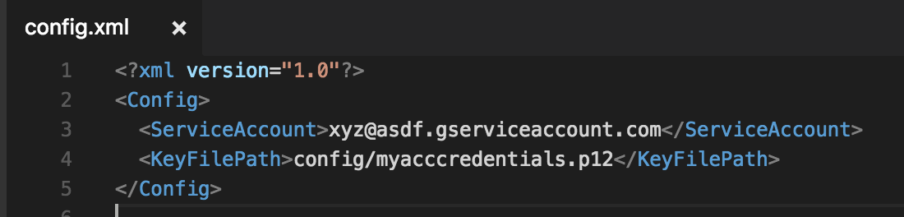
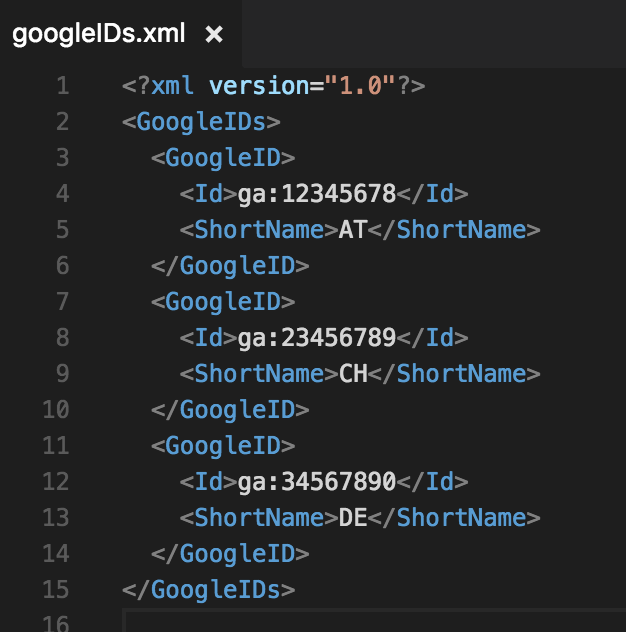
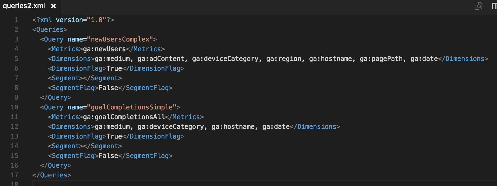

# GoogleAnalytics-Data-Loader
loads Google Analytics queries via API and saves it as CSV or JSON file.

# Requirements
To make use of this java application you need a google account with a linked analytics account and 
a .p12 file with the credentials to your account.
To obtain such a .p12 file follow these steps:
    - Go to [Google Cloud Console](https://console.developers.google.com/)
    - select "Credentials" (on the left hand side)
    - Click "Create Credentials" and select "Service account key"
    - Service Account doesn't really matter (as far as I know?!)
    - and choose "P12" as Key-Type
Now safe this to a path that is accessible to your .jar and you're ready to fire.

# How can I get the data I want?
Its all about the xml-files where you can customize the queries and googleAccounts you want to access.
The following config files are necessary:
    - config.xml -> includes your service account information (service-account email and path to the obtained .p12 file)
    - googleIDs.xml -> the google analytics accounts you want to use (could be one or more )
    - queries.xml -> where you define your queries. 1 query = one exported file (contains metrics, dimensions, segments)
(In the end it doesn't matter how you call those XML-files as you have to pass those names as a parameter anyway, but it is
recommended to name them in a reasonable manner).

Examples:

config.xml:

- ServiceAccount: mail of your service account (probably something cryptic)
- KeyFilePath: path to your .p12 file (path needs to be relative to your .jar file!!)

googleIDs.xml


- Id: Google Analytics ID
- ShortName: Will be the prefix of your result for this analytics id

queries.xml:


    - Query name: the filename of the query
    - Metrics: all metrics (seperated by ',') 
    - Dimensions: all dimensions (seperated by ',')
    - DimensionFlag: "True" or "False" depending on whether you used Dimensions or not.
    - Segment: all applied segments here
    - SegmentFlag: "True" or "False" depending on whether you used a Segment or not.

# How can I make use of this?
Everything you need is within the "executable" folder. You just need to adapt it according
to your needs. It is just a command line tool, because a user interface seemed less convenient 
to me when you want to automate processese, but feel free to to commit a UI ;)
you execute this via: java -jar {pathToYourJar} {inputParameters}

possible parameters: 
    -q : Path to your queries.xml
    -i : Path to your GoogleIDs.xml
    -c : Path to your config.xml
    -sd : start date (format: YYYY-MM-DD)
    -ed : end date (format: YYYY-MM-DD)
    -sy : start year (format: YYYY)
    -ey : end year (format: YYYY)
    -tp : path were the exported files will be saved
    -f : format (csv or json / default is csv)
    -sm : start month
    -em : end month

Basically you loop through your time period in monthly steps, except when you define start date and end date. 
Then you get the stacked data for this period. (just one csv).
If you set no time params you get the data of the last month.

Example usage:
```
    java -jar GoogleAnalyticsLoader.jar -q queries.xml -i googleIDs.xml -c config.xml -tp /your/path/
```
A bash file for a cron job that runs every month to get the monthly reporting data could look like this:

```
folder_name=$(date +%Y)${current_month}$(date +%d)
path=/insert/your/path/here/${folder_name}

#create Folder
mkdir -p ${path}
mkdir -p ${path}/logs #log-folder

echo folder ${path} created...

#Analytics (java)
mkdir -p ${path}/SEO/Analytics
cd /path/to/your/jar/file/
java -jar config/google2.jar -q config/queries3.xml -i config/googleIDs.xml -c config/config2.xml -tp ${path}/SEO/Analytics/ > ${path}/logs/seo_analytics.log
echo Analytics finished!
```

# Dependencies
This repository makes use of the Google Analytics API. Find more information about how to use it [here](https://developers.google.com/analytics/)